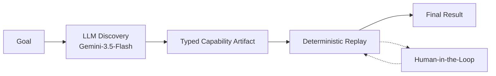

# Legacy Financial Agent : Discover, Record, Replay

An agent learns a task in a legacy-style banking web app by driving it once with
an LLM, compiles what it learned into a **capability artifact**, and then replays
that artifact **deterministically with no model in the loop**. When the UI blocks
it, it either classifies the situation as a business outcome or hands the live
browser session to a human and takes it back afterwards.

The target app (`apps/legacy_core`) is a deliberately awful mock: frameset-style
`iframe`, `ctl00_`-prefixed ids, table layout, server round-trips.

- **Contracts** (frozen first, everything else obeys them): [`docs/CONTRACT.md`](docs/CONTRACT.md)
- **Design write-up**: [`REPORT.md`](REPORT.md)
- **Handoff mechanics**: [`docs/HITL.md`](docs/HITL.md)
- **Mock UI tour**: [`docs/MOCK_UI.md`](docs/MOCK_UI.md)
- **Committed run artifacts**: [`evidence/README.md`](evidence/README.md)

# Intution 





---

## Setup

Python 3.10+.

```bash
python3 -m venv .venv
source .venv/bin/activate
pip install -r requirements.txt
playwright install chromium
```

The mock server starts itself on `http://127.0.0.1:8000` when a command needs it,
so there is nothing else to launch.

> On Apple Silicon, if Playwright reports a missing `chrome-headless-shell`
> binary, force a matching download with `playwright install --force chromium`.

### LLM API Key 

```bash
cp .env.example .env
```

```ini
GEMINI_API_KEY=your-key-here
DISCOVERY_MODEL=gemini-3.5-flash
DISCOVERY_BASE_URL=https://generativelanguage.googleapis.com/v1beta/openai/
```

Google Gemini is reached through its OpenAI-compatible endpoint with `httpx`; no
vendor SDK. `.env` is gitignored — only `.env.example` is committed.

Free-tier keys allow **20 requests per day per model** and one discovery run
costs about five, so `src/llm.py` falls back down a chain of flash models when
one is saturated or out of quota. Override the chain with
`DISCOVERY_FALLBACK_MODELS`. `gemini-2.5-flash` is closed to new keys, so name a
current model.

---

## Demo path

Run these in order. Every command writes a curated directory under `evidence/`;
each one prints the result envelope (`status`, `outcome_code`, `outputs`) to
stdout and its evidence path.

### 1. LLM discovery — learn the task from a goal

Needs the key. `--headed` lets you watch it work.

```bash
python -m src discover \
  --goal "Look up a member's savings account balance by member ID" \
  --member-id 12345 --headed
```

Observation is a compact **AX-tree text** rendering of frame `content` — no
screenshots, no pixels, no vision model. The model gets five flat tools (`fill`,
`click`, `extract`, `done`, `escalate`) and at most 20 steps. On `done` the
compiler parameterizes the member id, drops the transcript, and writes:

```
capabilities/lookup-savings-balance.discovered.json
```

Use `--output` for a different path. A run is already committed at
[`evidence/discovery/`](evidence/discovery/) if you have no key.

### 2. Replay the discovered capability — deterministic, no LLM

```bash
python -m src --capability capabilities/lookup-savings-balance.discovered.json --member-id 12345
```

→ `success` / `ok`, with `savings_balance` extracted. Evidence:
`evidence/replay-success/`.

### 3. Same artifact, different input — a business outcome, not a crash

```bash
python -m src --capability capabilities/lookup-savings-balance.discovered.json --member-id 99999
```

→ `business_outcome` / `member_not_found`. Member `99999` does not exist, so the
app shows "Record not found". The automation worked perfectly; the *answer* is
that there is no such member. Evidence: `evidence/replay-not-found/`.

The hand-written `capabilities/lookup-savings-balance.json` is the default
`--capability`, so `python -m src --member-id 12345` also works.

### 4. HITL demo A — expired session, human clears it, automation resumes

Two terminals are not needed; the operator prompt is on stdin.

```bash
python -m src --member-id 12345 --entry "/?expired=1" --headed --operator cli
```

Replay hits the **Login expired** screen, detects `session_expired`, writes
`intervention_request.json`, and flips the session to `controller: human`. The
same browser window stays open on the same page.

- In the **browser**, click **Restore session** yourself.
- In the **terminal**, type `resume`, then a note.

Replay re-verifies the page, retries the step it failed on (not the next one),
and finishes `success`. While you hold the session, automation is locked out:
any `fill`/`click` raises `ControllerLocked`.

Type `abort` instead to end the run `escalated`. Resuming *without* clearing the
banner is also instructive — re-verification refuses to continue and hands the
session back. That is the run committed in `evidence/replay-session_expired/`.

### 5. HITL demo B — irreversible action requires a human

```bash
python -m src --capability capabilities/open-sub-account.json \
  --policy policies/allowlist-hitl.yaml --headed --operator cli
```

Opening a sub-account is irreversible, and `policies/allowlist-hitl.yaml` sets
`irreversible.mode: require_human`. Automation stops **before** clicking
`Confirm open` and escalates → `escalated` / `irreversible_blocked`. Even if you
type `resume`, re-verification records `human_owns_step` and refuses to let
automation retry an irreversible step. Evidence:
`evidence/replay-irreversible_blocked/`.

With the default `policies/allowlist.yaml` (`irreversible.mode: block`) the same
command is refused outright as `failed` / `irreversible_blocked`:

```bash
python -m src --capability capabilities/open-sub-account.json
```

### 6. Guardrail denials

Each is refused by policy, with the expectation and the observation recorded.

```bash
# Action outside allowed_actions -> failed / action_not_allowlisted
python -m src --demo-action download

# Off-origin navigation -> failed / origin_not_allowlisted
python -m src --member-id 12345 --base-url http://example.com

# Path outside the allowlisted prefixes -> failed / path_not_allowlisted
python -m src --member-id 12345 --entry /admin
```

---

## Tests

No LLM, no network, no browser. They cover the schema, locator ordering, outcome
classification, redaction and the allowlist.

```bash
pip install -r requirements-dev.txt
pytest
```

The handoff flow needs a real browser, so it has its own harness with a scripted
operator standing in for the human (it writes evidence to a temp dir, never to
`evidence/`):

```bash
python scripts/verify_phase5.py
```

---

## Layout

| Path | What lives there |
| --- | --- |
| `apps/legacy_core/` | Flask mock: iframe shell, `ctl00_` ids, table layout |
| `schemas/capability.schema.json` | The capability artifact schema |
| `capabilities/` | Artifacts: hand-written and discovered |
| `policies/` | Origin/path/action allowlist and irreversible mode |
| `src/observe.py` | AX-tree text observation with refs |
| `src/discover.py` | The LLM observe-decide-act loop |
| `src/compiler.py` | Tool calls → capability artifact |
| `src/replay.py` | Deterministic, resumable replay |
| `src/classify.py` | Checkpoint vs known-outcome classification |
| `src/surface.py` | Locator resolution and the controller gate |
| `src/guardrails.py` | Allowlist, action and irreversible checks |
| `src/hitl.py` | Operator surfaces, intervention requests, handoff records |
| `src/redact.py` | Digit-run and secret masking |
| `evidence/` | Committed run artifacts (traces, AX/DOM, handoffs) |

## Result 

Every replay ends in exactly one of four statuses :

| Status | Meaning |
| --- | --- |
| `success` | Goal reached and the checkpoint is visible |
| `business_outcome` | The app gave a real, classified answer (e.g. `member_not_found`) |
| `failed` | Automation could not proceed and no human is involved |
| `escalated` | A human holds, or held, the session |
