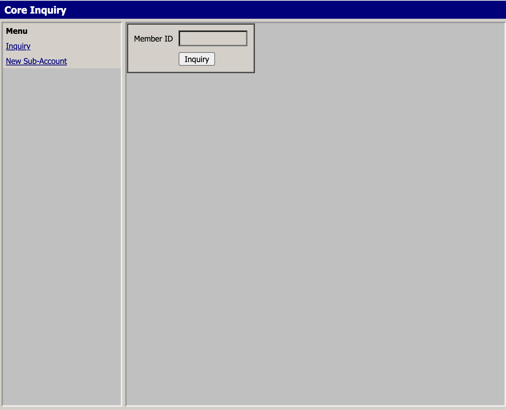
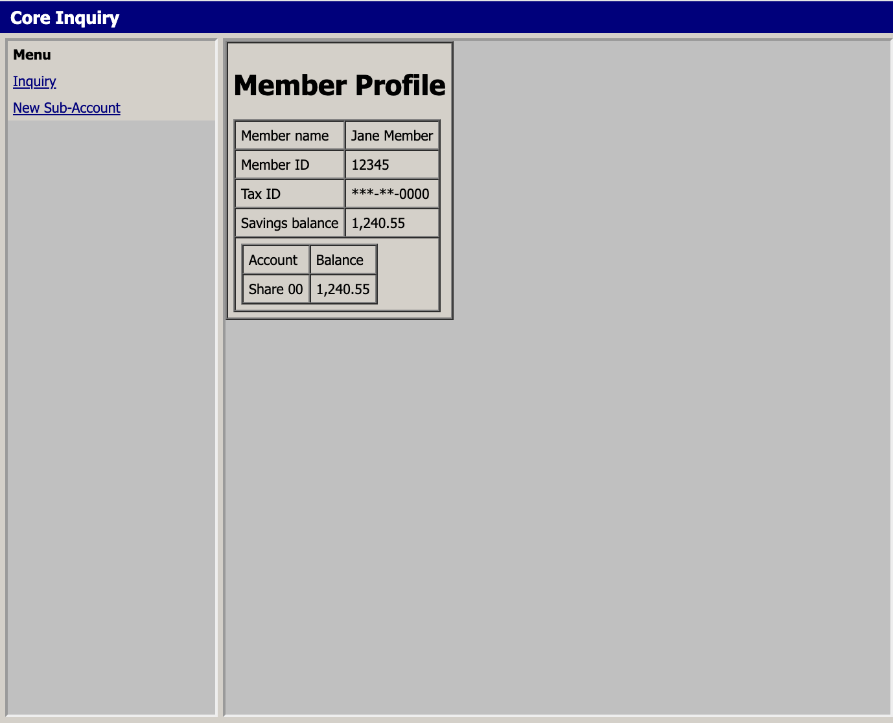
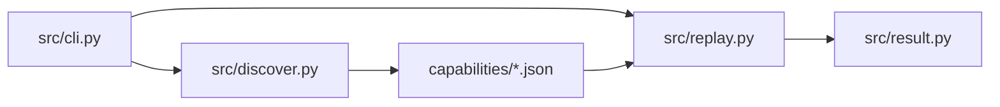

# Report

An agent that learns a task in a legacy web app once, then repeats it without a
model in the loop. The organizing decision is that **discovery and execution are
different problems** and should not share a code path: discovery is expensive,
non-deterministic and needs judgment; execution needs to be boring, auditable and
cheap. Everything below follows from keeping them apart.

Here we are building an AI agent for computer-use automation. We chose to mock an old-style UI like the one below, with a list of allowed operations and a compact accessibility-style view of the page rather than screenshots. Only in the discovery loop is the LLM called: it maps the live UI to actions until the task succeeds, and that successful path is compiled into a recipe. Replay then runs that recipe as needed, without calling the model again.

<p align="center">
  
  
</p>


## 1. Architecture


### 1. `src/cli.py` — the front door

One entry point: `python -m src …`

- If you pass `--goal` / `discover` → discovery path (needs `GEMINI_API_KEY`).
- Otherwise → replay path (no key).
- Starts / reuses the Flask mock at `http://127.0.0.1:8000`, loads policy YAML, chooses headed/headless and HITL operator mode.

Think of it as traffic control, not business logic.

### 2. `src/discover.py` — observe → decide → act (LLM once)

This is the only place that calls Gemini.

Rough loop:

1. Open Playwright against the mock (`content` frame).
2. Build a compact text observation (role / name / nearby / refs) — not a screenshot.
3. Send system prompt + goal + observation to Gemini with five tools: `fill`, `click`, `extract`, `done`, `escalate`.
4. Execute the tool against the live page (after allowlist checks).
5. Re-observe, append history, call again until `done` / escalate / max steps.
6. On success, `src/compiler.py` turns the successful actions into a capability JSON (parameterized `member_id`, locators, checkpoint, known outcomes). The model’s chat is discarded.

So discovery grounds the goal on the live UI; the compiler writes the recipe.

### 3. `capabilities/*.json` — the durable skill

Versioned artifact: steps, locator strategies (role+name first), `input_schema` / `output_schema`, checkpoint, `known_outcomes`.

Examples in the repo:

- `lookup-savings-balance.json` — hand-written (replay worked before LLM existed)
- `lookup-savings-balance.discovered.json` — compiled from a discovery run
- `open-sub-account.json` — irreversible / HITL demo

This is the product of discovery and the input to replay. Same file can be reused for many members with no more model calls.

### 4. `src/replay.py` — deterministic execution (no LLM)

Loads the artifact, binds `--member-id`, walks steps in order, resolves locators, classifies outcomes (`success` / `business_outcome` / `failed` / `escalated`). Session expired or irreversible steps can pause for HITL on the same browser session, then re-verify before continuing.

Replay cost in API dollars: **$0**.

### 5. `src/result.py` — typed exit status

Structured result: status, outcome code, outputs, expected vs observed, evidence dir. Written under `evidence/<run>/` with traces and redacted AX/DOM snapshots.

**Discover** (`src/discover.py`) runs an observe-decide-act loop against the live
mock. Each turn it renders frame `content` as compact **AX-tree text** with
stable refs (`src/observe.py`), hands the model five flat tools — `fill`,
`click`, `extract`, `done`, `escalate` — and applies the one it picks through the
same surface adapter replay uses. Capped at 20 steps.

**Compile** (`src/compiler.py`) turns the accepted tool calls into a capability
artifact: it parameterizes the member id, keeps the ordered locators the loop
actually resolved, attaches the checkpoint and the known outcomes, and **drops
the transcript**. The artifact is the deliverable; the conversation is not.

**Replay** (`src/replay.py`) loads that JSON and executes it with **no LLM and no
network egress**. Same `src/surface.py`, same `src/guardrails.py`, same
`src/session.py` as discovery, so replay cannot do anything discovery was not
allowed to do.

Observation is text, not pixels. Screenshots would cost more per step, ship
account numbers and names to a model provider on every turn, and give back
coordinates that break on the next vendor patch. An AX tree is also **the same
control model as OS accessibility APIs** (`AXUIElement`, UIA), so the observe
and act interfaces port to a Win32 or terminal surface without touching the
capability schema or replay — only the adapter changes.

***Gemini: tokens and rough cost***

**When:** discovery only.  
**Model:** `gemini-3.5-flash` via Google’s OpenAI-compatible `chat/completions` endpoint.  
**What is sent each turn:** full message history + the five tool schemas (~400 tokens of tools alone, every call).

For a successful lookup on this mock (typical ~4 model turns: fill → click → extract → done):

| | Approx |
|---|---|
| Input tokens (whole run) | ~4,500 |
| Output tokens | ~250 (short tool calls) |
| Total | ~4,700–5,000 |

Input grows because tools + system (~630 tokens) are resent every turn, and observations (~140 each) accumulate. Call 1 is ~800 tokens in; call 4 is ~1,400.

**Paid-tier rough cost** for Gemini 3.5 Flash (list prices ~**$1.50 / 1M input** and **$9.00 / 1M output**, including thinking tokens if enabled):

```text
4500 × $1.50 / 1e6  +  250 × $9.00 / 1e6  ≈  $0.009
```

So about **0.9¢ per successful discovery** on this flow. On the free tier the same run is $0 until you hit per-model daily quota. Replay remains **$0** either way.

These are char/4 estimates from a saved run, not billed meter reads; retries, escalate paths, or thinking tokens can push the total higher.

## 2. Artifact schema

`schemas/capability.schema.json`, frozen in `docs/CONTRACT.md` §2 before any code
was written. A capability is `{ apiVersion, id, name, version, app,
input_schema, output_schema, risk, checkpoint, known_outcomes, steps[] }`.

The parts that carry weight:

- **Typed `input_schema` / `output_schema`.** An agent calls the capability like
  a function. `12345` is an argument, not part of the skill — the schema test
  asserts the discovery run's member id never appears in the artifact.
- **`steps[].target.strategies[]`, ordered.** A list, not one selector, so
  resolution degrades in a declared order instead of guessing.
- **`checkpoint`.** Replay never assumes a click worked; it asserts a control is
  visible afterwards.
- **`known_outcomes[]`.** Banner classifiers that make a legitimate app response
  a typed result rather than a timeout.
- **`risk`** plus a `tenant: { app_family, overlays: [] }` stub, so a per-tenant
  overlay can specialize later without changing the artifact's shape.

`apiVersion` and `version` are separate: the envelope can outlive any one skill.

## 3. Determinism & error handling

**Locators.** `role` + accessible name first; then `nearby_text`, then
`accessible_name`; **CSS last, and never primary**. `resolve_target` refuses a
css-first target with `CssPrimaryForbidden` before it touches the page. This is
not stylistic — the mock's ids look like `ctl00_Main_txtCIF`, which is generated
by the vendor's framework and will not survive a patch, while "the textbox
labelled Member ID" is what the task actually means. CSS stays in the list as a
last resort because sometimes a legacy control has no accessible name at all.

**First hit wins, and there is no silent self-healing.** Strategies are tried in
declared order and the first visible match is used. If none resolve, replay
raises `LocatorMiss` and stops. It does not fuzzy-match a similar-looking
control, and it does not rewrite the artifact behind your back: a capability that
quietly repairs itself is a capability nobody can review, and in a bank the
failure mode of "clicked something that looked close enough" is worse than
stopping.

**Four statuses, and the distinction that matters most.** Every run ends in
exactly one of `success`, `business_outcome`, `failed`, `escalated`.

`business_outcome` exists because **"Record not found" is an answer, not a
bug.** Member `99999` produces it; the automation drove the form correctly, the
app responded correctly, and the result is that no such member exists. Treating
that as a failure would be wrong twice: it hides a real answer from the caller,
and it fills a retry queue with work that will never succeed. So known outcomes
are declared in the artifact, checked before the checkpoint, and returned as
typed results. `failed` is reserved for cases where the automation genuinely
could not proceed — locator miss, timeout, policy denial.

Every terminal result carries `expected` and `observed`, so a failure says what
it was looking for and what was on screen instead. Evidence is a Playwright
trace plus AX/DOM snapshots, written per run.

## 4. Heterogeneity & multi-tenant

The same core banking product deployed at 200 credit unions is 200 skins over
one workflow: the field is still "member id", the button is still "Inquiry", but
the label is "CIF Number" here and "Account Lookup" there, and the route is
`/inquiry` here and `/apps/inquiry.aspx` there.

The answer is **one base capability per app family plus a thin per-tenant
overlay**, not 200 capabilities. The base artifact carries the workflow — step
order, bindings, checkpoint, known outcomes, risk. An overlay carries only the
deltas: extra locator strategies to splice into a step's ordered list, label
synonyms, and route rewrites. Discovery runs once per family; onboarding a
tenant is authoring or discovering a small overlay, and a tenant's quirk can
never silently change another tenant's step order.

Two properties of the existing design make this work. Locators are already
**ordered lists**, so an overlay prepends tenant-specific strategies and the base
ones stay as fallbacks — no merge logic. And **routes are canonicalized**: the
artifact stores a logical entry path (`/`) that is resolved against the tenant's
base URL and path allowlist at run time, never an absolute URL, so a tenant that
mounts the app under a different host or prefix changes configuration rather than
the capability.

The schema reserves `tenant: { app_family, overlays: [] }` for this. It is a stub
— see Cuts.

## 5. Escalation & handoff

A handoff is a **flag flip on the same live browser session**: same Playwright
process, same context, same page. No second automation path, no co-browsing
console, no re-login. `automation` → `human` → `automation`.

`WebSession` registers a controller gate on the page and `src/surface.py` checks
it inside `fill` and `click`, so any caller that tries to act while
`controller == "human"` raises `ControllerLocked`. The check sits on the act
itself, not on the good manners of the caller. Reads stay open, because
re-verification has to observe the page. A human driving the headed window is
unaffected — they use the mouse, not the Playwright API.

Escalation is routed by cause, not by severity:

- **Policy** — an irreversible step under `irreversible.mode: require_human` is
  always `escalated`, whether or not anyone is listening. The run belongs to a
  human.
- **Recoverable failure** — `session_expired` or `locator_miss` escalates only
  when an operator surface is attached. With nobody there, it stays `failed`
  rather than pretending a human will arrive.

`session_expired` is detected explicitly by the **Login expired** banner;
otherwise the mock's expired screen would surface as a bare locator miss, since
the Member ID textbox is simply absent. The escalation writes an
`intervention_request.json` — `session_id`, goal, failed step, why, AX and DOM
snapshot paths, controller — with **no screenshot field anywhere**.

**Hand-back re-verifies; it never resumes on trust.** On `resume` replay flips to
`automation` and checks, in order: a known-outcome banner is visible (terminal
`business_outcome`); the checkpoint is visible (`success` — the operator finished
by hand); the step was irreversible (terminal, `human_owns_step` — automation
never retries it); the blocker is gone and the failed step's locator resolves
(**retry that step**, not the next one); otherwise back to `human`, terminal
`escalated`, with the verdict recorded in `observed`. `handoff.json` records the
operator, the decision, the note, the verdict and every controller flip.

## 6. Safety

**Allowlist, fail closed.** `policies/allowlist.yaml` declares allowed origins,
path prefixes and actions. Anything not listed is refused — an unknown action
denies rather than defaults through. Actions are restricted to `fill`, `click`,
`extract`, `wait`; `download`, `file_upload` and free-form JS are not
implementable, not merely discouraged. Navigation is checked against the live URL
during the run, not only at startup, so a redirect off-origin is caught.

**Irreversible actions are recognized by name and by risk**, and the policy picks
the mode: `block` refuses outright (`failed`), `require_human` escalates to a
person (`escalated`). Automation never clicks `Confirm open` in either mode —
the evidence DOM is checked for the mock's post-confirm page to prove the POST
never happened.

**Redaction on write.** Digit runs of five or more are masked to their last four
(`****2345`), password assignments, `api_key`-style values, cookie headers and
password input values are stripped, and the JSON walker replaces sensitive keys
wholesale. Four-digit runs survive so ports stay readable in URLs. Traces are
captured with `screenshots=False`, so no image of a customer's account ever
lands on disk, and `evidence/` was audited for images, unmasked ids and secrets
before committing.

**Secrets.** `.env` is gitignored; only `.env.example` is committed. Replay needs
no key at all, which means the deterministic path has no credential to leak.

## 7. Cuts

- **No image screenshots.** AX text only, everywhere — including evidence. Cost,
  PII exposure, and brittleness. If a control has no accessible name, this build
  cannot see it.
- **No desktop or terminal surface.** The adapter is web/Playwright only. The AX
  observation model was chosen so a Win32/UIA surface would port, but that port
  is not written.
- **The operator UI is mocked.** `--operator cli` prints the intervention request
  and blocks on stdin. There is no queue, no operator console, no assignment or
  SLA. The contract fixes the intervention request and the controller flip, so
  substituting a real UI does not touch replay.
- **Multi-tenant overlays are not implemented.** §4 is a design backed only by a
  schema stub: `tenant` is optional and no committed artifact sets it. There is
  no overlay resolver, no second tenant and no synonym table. One tenant is
  exercised.
- **No queues, workers or services.** A CLI and a Flask mock. No API server, no
  scheduler, no persistence beyond files on disk, no concurrency story.
- **One capability family.** Savings-balance lookup, plus `open-sub-account`
  purely as an irreversible-action fixture. No process graph across multiple
  capabilities and no planner composing them.
- **Self-healing locators are refused, not missing.** A capability whose
  selectors drift under it should fail loudly and be re-discovered by a human,
  and the honest cost of that choice is that a trivial label change breaks
  replay until someone reviews it.
