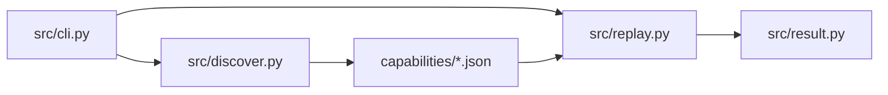
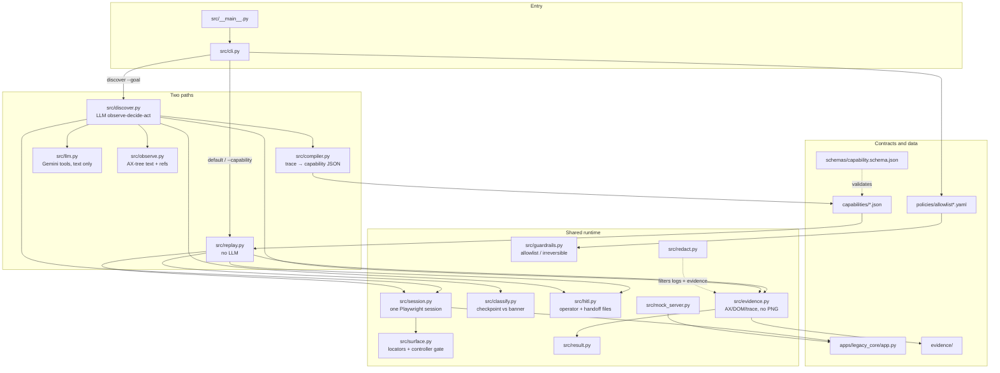
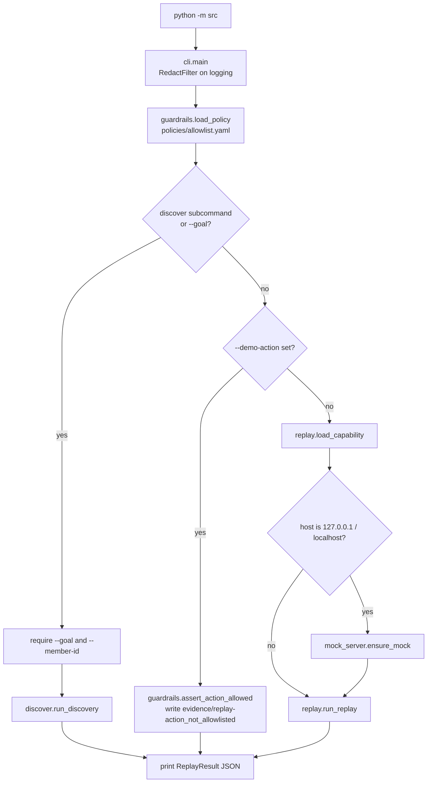
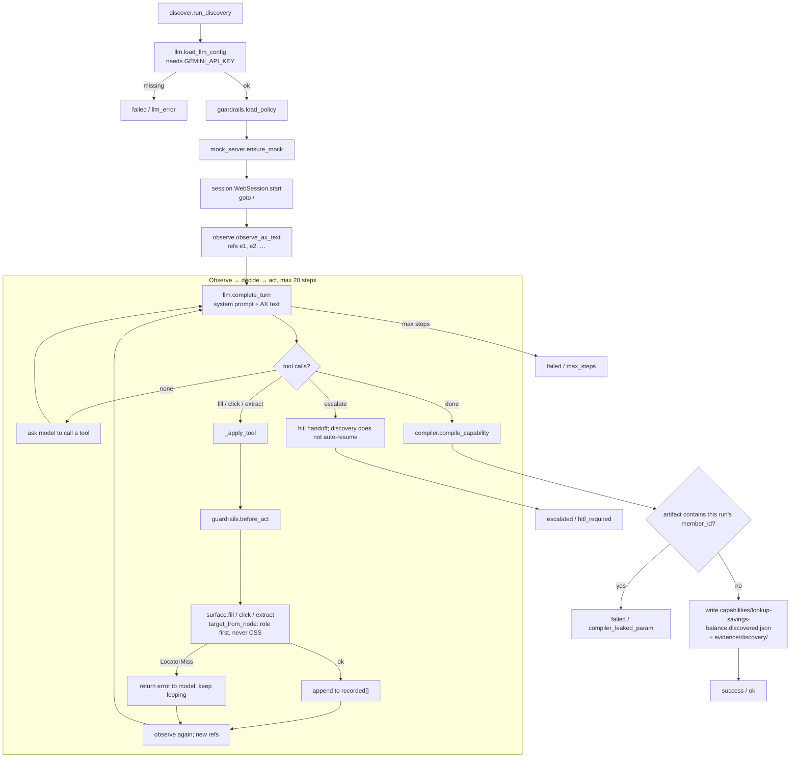
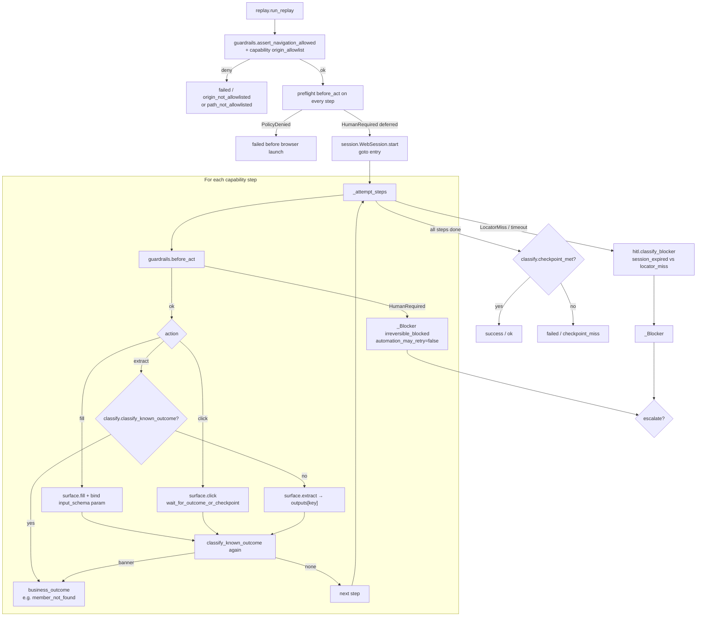
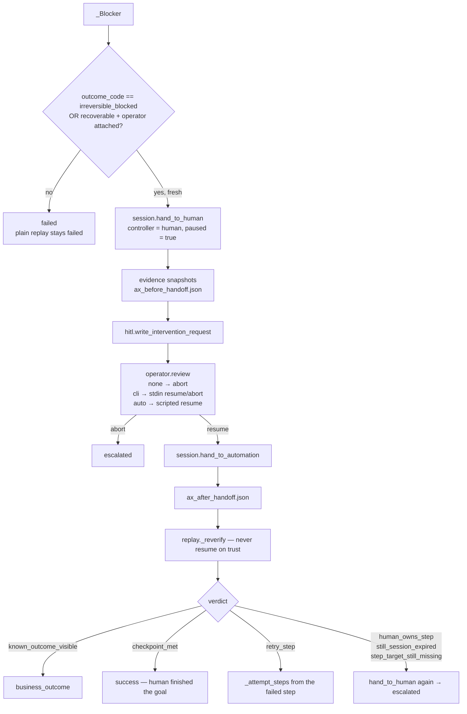
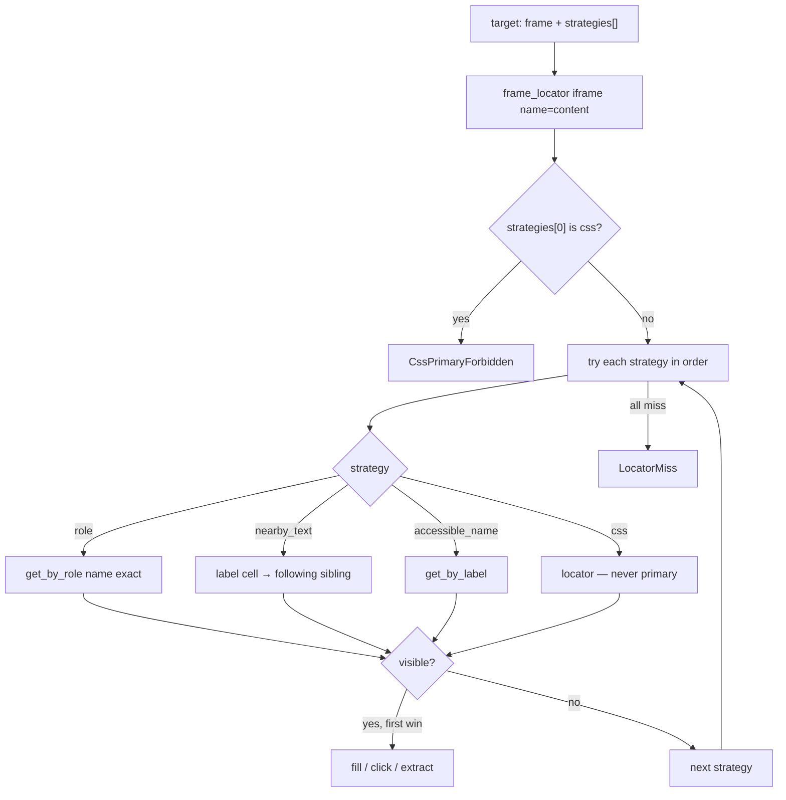
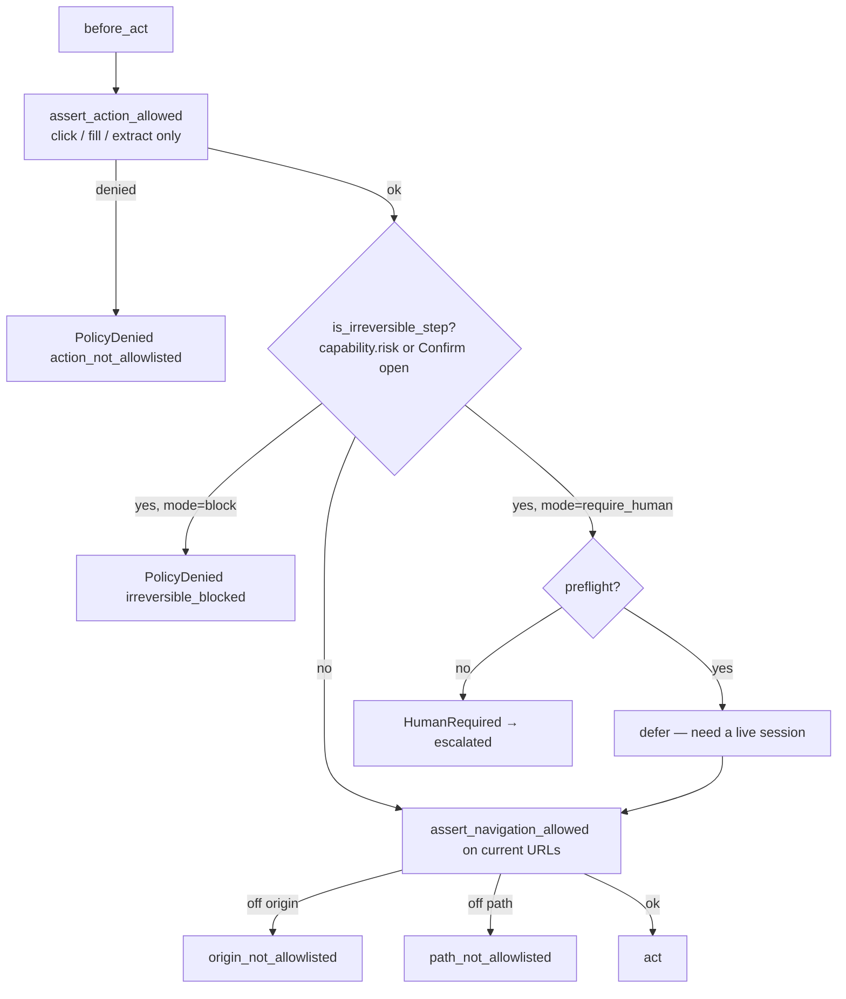
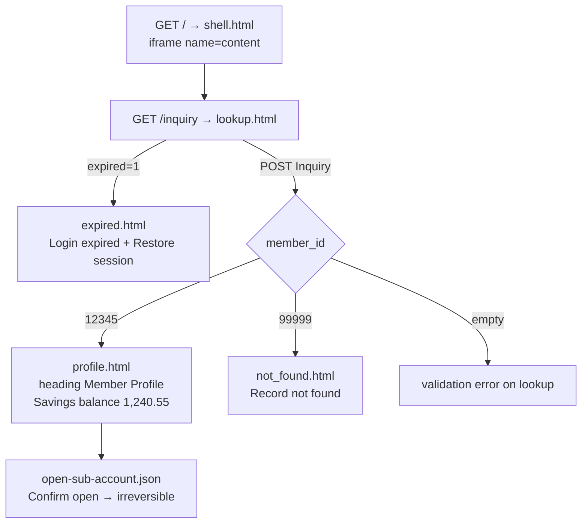

# Code-file logic flow

The model discovers; the artifact is the capability; deterministic replay is production.
Replay never calls an LLM. Observation is AX-tree **text**, never pixels.

---

## 1. Files at a glance

| File | Job |
| --- | --- |
| `src/__main__.py` | `python -m src` → `cli.main` |
| `src/cli.py` | Parse args; route discover vs replay vs `--demo-action` |
| `src/discover.py` | LLM loop: observe → tool call → act → compile |
| `src/llm.py` | Gemini chat/completions; tools `fill/click/extract/done/escalate` |
| `src/observe.py` | Compact AX text of iframe `content`; stable refs for one observation |
| `src/compiler.py` | Recorded tool calls → capability JSON; drop transcript; parameterize `member_id` |
| `src/replay.py` | Bind params, run steps, classify, HITL resume; **no LLM** |
| `src/session.py` | One Chromium context; tracing; `controller` flag; network guard |
| `src/surface.py` | Ordered locators (role → nearby_text → accessible_name → css); fill/click/extract |
| `src/guardrails.py` | Origin/path/action allowlist; irreversible block vs `require_human` |
| `src/classify.py` | Known banner (`business_outcome`) vs checkpoint (`success`) |
| `src/hitl.py` | Operator (none/cli/auto); intervention request; session-expired detect |
| `src/evidence.py` | `result.json` + AX + DOM + Playwright trace |
| `src/result.py` | Envelope: `success` / `business_outcome` / `failed` / `escalated` |
| `src/redact.py` | Mask digit runs, cookies, passwords in logs and evidence |
| `src/mock_server.py` | Start Flask mock on `127.0.0.1:8000` if nothing is listening |
| `apps/legacy_core/app.py` | Frameset mock: lookup, not-found, expired, confirm open |

---

## 2. CLI routing (`src/cli.py`)

Exit code `0` for `success` / `business_outcome`, `2` otherwise.

---

## 3. Discovery path (LLM once)

Thesis: the model drives the mock **once**. The compiler writes a reusable skill. Production never sees the transcript.

What the compiler **drops**: chat transcript, chain-of-thought, raw AX dumps, the concrete member id.

What it **keeps**: ordered `fill` / `click` / `extract` steps, role+name locators, `input_binding` for `member_id`, checkpoint, `known_outcomes`.

---

## 4. Replay path (no LLM)

Replay **does not invent locators**. First strategy hit wins; CSS cannot be primary (`CssPrimaryForbidden`).

---

## 5. HITL on the same session (`src/hitl.py` + `src/session.py`)

Handoff is a flag flip on the **same** Playwright page. No second window.

`surface.fill` / `click` call `assert_controller_allows`. While `controller=human`, automation raises `ControllerLocked`.

Irreversible steps (`policies/allowlist-hitl.yaml`, `irreversible.mode: require_human`) never retry after resume: `_reverify` returns `human_owns_step`.

---

## 6. Locator resolution (`src/surface.py`)

Same adapter for discovery and replay. Desktop would swap this module, not the capability JSON.

---

## 7. Guardrails before every act (`src/guardrails.py`)

`session.WebSession` also aborts off-allowlist network requests at the Playwright route layer.

---

## 8. Mock app (`apps/legacy_core/app.py`)

What replay and discovery actually drive:

---

## 9. Result envelope (`src/result.py`)

Every path ends in one of four statuses. Evidence is written by `src/evidence.py` (trace + AX + DOM, **no screenshots**), with PII masked by `src/redact.py`.

| `status` | Typical `outcome_code` | Who decided it |
| --- | --- | --- |
| `success` | `ok` | `classify.checkpoint_met` after all steps |
| `business_outcome` | `member_not_found` | `classify.classify_known_outcome` — automation worked |
| `failed` | `locator_miss`, `action_not_allowlisted`, `origin_not_allowlisted`, `irreversible_blocked` (block mode), `checkpoint_miss` | Guardrail or locator; no operator |
| `escalated` | `hitl_required`, `session_expired`, `irreversible_blocked` (require_human) | `hitl` handoff on the same session |
